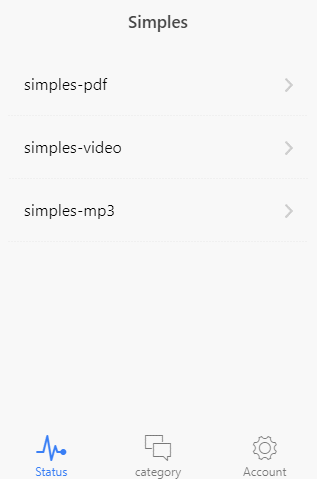
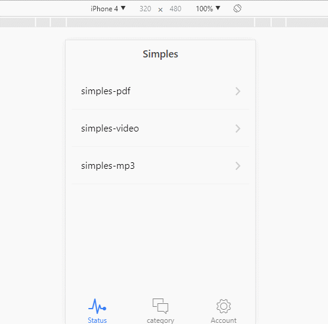
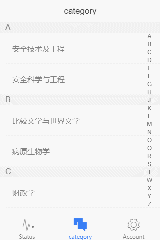
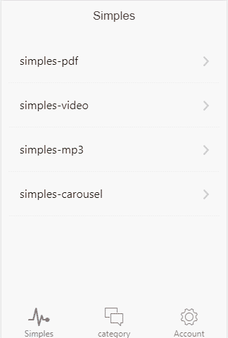

# ionic v1 tab app template demo

## Branches

- Current branch is **ionic-v1**, switch to [ionic-angular branch](https://github.com/johnnynode/ionic-samples/tree/ionic-angular)

## Clone

- $ `git clone -b ionic-v1 git@github.com:johnnynode/ionic-sample.git  --depth 1`

## Install

- $ `cd ionic-sample`
- $ `yarn install` or $ `npm i`
- $ `bower install --force` (manual operation not in scripts)

## Run

- $ `gulp server` 

## Build

- $ `gulp build`

## Build-server

- $ `gulp build-server`

## Beware

- pdf url may need cross the wall if you are in China: https://mozilla.github.io/pdf.js/web/viewer.html 
- video url is from videogular: http://static.videogular.com/assets/videos/videogular.mp4
- music url is a local file in `src/media/audio/music.mp3`
- about cross domain, see more @ api of [gulp-connect](https://github.com/AveVlad/gulp-connect)

## PdfLoading

  
   
   
  

    <a target="_blank" href="http://blog.csdn.net/tyro_java/article/details/73058952">Related Blog</a>
  

## AudioPlay

  
   
   
  

    <a target="_blank" href="http://blog.csdn.net/tyro_java/article/details/73043991">Related Blog</a>
  

## VideoPlay

  
   
   
  

    <a target="_blank" href="http://blog.csdn.net/tyro_java/article/details/73040008">Related Blog</a>
  

## CategoryScrolling

  
   
   
  

    <a target="_blank" href="http://blog.csdn.net/tyro_java/article/details/77622455">Related Blog</a>
  

## CarouselScaleBanners

  
   
   
  

    <a target="_blank" href="http://blog.csdn.net/tyro_java/article/details/77937586">Related Blog</a>
  

## About Splash

- [ionic-splash-demo@johnnynode](https://github.com/johnnynode/ionic-splash-demo)

## License

MIT