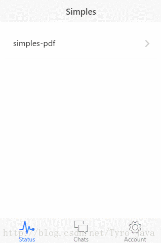

# ionic v1 的 tab app 模板演示

### 关于samples
- pdf 如果pdf长时间打不开，请翻墙，pdf预览地址是：https://mozilla.github.io/pdf.js/web/viewer.html
- 视频源地址是videogular官网上的一个视频demo地址：http://static.videogular.com/assets/videos/videogular.mp4
- 音频源使用网上链接易失效，存放于本地audio文件夹下：www/audio/music.mp3

### 视频播放效果

  

### 音频播放效果

  

### pdf展示效果

  

### 克隆
$`git clone git@github.com:johnnynode/ionic-sample.git --depth 1`  

###　运行
$`cd ionic-sample`  
$`npm i`  

###　备注
- 只为演示，未使用gulpfile.js文件